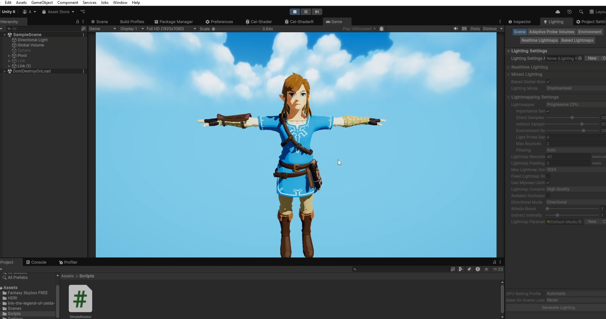

# Cel-Shading Tutorial para Unity [URP]

Bienvenido/a al repositorio de **Cel-Shading Tutorial**, soy Alejandro de [Photon Factory](https://www.youtube.com/@PhotonFactoryGames).  
Aquí encontrarás shaders listos para usar, modificar y distribuir libremente.

## 📥 Instalación
1. Clona/descarga este repositorio.
2. Agrega el proyecto desde Unity Hub usando "Add Project from disk".
3. Abre el proyecto con una versión compatible.

## 🎮 Uso
Aplica el shader a un material y ajusta los parámetros según tus necesidades.  
Ejemplo de resultado:

## 📜 Licencia
Este proyecto es de código abierto bajo la licencia **MIT**.

## 💬 Soporte y comunidad
- ¿Tienes dudas? Déjalas en los comentarios del [video tutorial](https://youtu.be/5gXoq97aWsI).  
- ¡Dale like al video si te ayudó! 👍

## 🤝 Contribuciones
Si quieres mejorar este proyecto, ¡PRs y Issues son bienvenidos!
